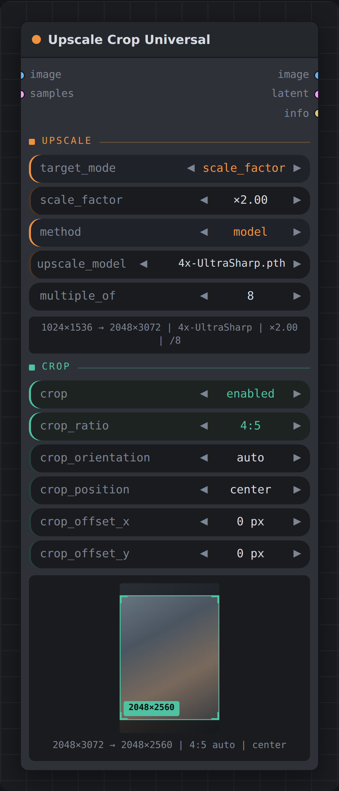

# Upscale Crop Universal — ComfyUI custom node

**Upscale and crop in one ComfyUI node — with the upscale model built in.**

Seven ways to ask for a size, all of them working downwards as well as up. Then,
optionally, a crop stage that cuts the exact format out of the result — drag the
window in the live preview to place it. The upscale model is picked by a widget straight from your
`models/upscale_models` folder, so there is no Load Upscale Model node to wire up.

Everything runs in torch and handles batches.

## Why this one

**The whole job is one node.** Getting "upscale with a model, land on an exact
size, cut it to 4:5" out of stock ComfyUI takes a chain:

```
stock ComfyUI     Load Upscale Model ─► Upscale Image (using Model) ─►
                  Upscale Image By ─► Image Crop ─► …and compute the numbers yourself

this node         Upscale Crop Universal
```

**The model is a widget, not a socket.** Every comparable pack —
[PlagueKind](https://github.com/PlagueKind/ComfyUI-PlagueKind-Nodes),
[Studio-nodes](https://github.com/comfyuistudio/ComfyUI-Studio-nodes),
[Deno2026](https://github.com/Deno2026/comfyui-deno-custom-nodes) — does resize and
crop well, and **none of them upscale with a model at all.** Here `method` defaults
to `model` and the file comes straight from `models/upscale_models`. No loader node,
no dangling `UPSCALE_MODEL` wire across your graph.

**It knows when *not* to use the model.** Ask for a downscale and the model is
skipped entirely rather than burning VRAM to upscale something you are about to
shrink. Ask for 2× with a 4× model and it upscales once, then comes back down —
instead of leaving you with a needlessly huge intermediate. No model selected? It
falls back to lanczos and says so in `info` instead of failing your queue.

**One model pass, on purpose.** Running a 4× model twice gives 16× and stacks the
artifacts. There is no pass-count widget to get wrong, and no tile size to babysit —
tiling reuses ComfyUI's own and halves itself if VRAM runs short.

**Latent and image, each sized on its own terms.** Connect either or both. A latent
is never assumed to be the image divided by eight, and the crop is applied in
normalised coordinates so the two come out framed identically. `multiple_of` divides
by 8 on the latent path, because a latent cell *is* eight pixels — snap a latent to 8
directly and you have rounded it eight times too coarsely.

**It is also your downscaler.** Every size mode works below 1.0. Most "upscale"
nodes refuse or misbehave going down; `area` is here precisely because it is the
right kernel for it.

**You see the crop before you queue.** The node draws the surviving window over your
image with the discarded area dimmed, live as you drag. The numbers come from the
same functions the node runs, so the preview cannot drift from the result — that is
pinned by tests.

**Comparison, fairly:** these packs are good at what they do, and the pieces they
share with this one are worth a look if the model being built in is not what you
need. Packs move fast — this was checked in August 2026.

## The two stages

```
             ┌─────────── UPSCALE ───────────┐  ┌──── CROP ─────┐
image ──────►│ percent · factor · shortest   │─►│ 4:5 1:1 3:2   │──► image
latent ─────►│ longest · megapixels          │  │ DIN 16:9 …    │──► latent
             │ aspect always preserved       │  │ off by default│──► width/height/info
             ├───────────────────────────────┴──┴───────────────┤
             │ width_height — an exact box, covered then cropped │
             └──────────────────────────────────────────────────┘
```

**Upscale** sets the size and never changes the shape. **Crop** takes the format
out of it, and only ever cuts — nothing is resampled a second time.

## Asking for a size

| `target_mode` | what it pins | when it is the natural one |
|---|---|---|
| `scale_percent` | 200% = double | you think in percent |
| `scale_factor` | ×2.0 = double | you think in multipliers |
| `shortest_side` | `min(w, h)` | feeding a model with a minimum edge |
| `longest_side` | `max(w, h)` | fitting a print or a screen |
| `megapixels` | total pixel count | staying inside a VRAM or upload budget |
| `width_height` | **an exact box**, cropped for you | the output size is non-negotiable |
| `custom` | the same box, **crop is yours** | you want to frame it yourself |

Percent and factor are the same arithmetic, offered both ways because which one
feels natural depends on the task. Every mode downscales when you give it a value
below the current size — set `scale_factor` to 0.5 and this is your downscaler.

The first five keep the aspect ratio. **`width_height` is the exception**, and the
one to reach for when the output size is not negotiable: it scales until the box is
covered, then crops to it, so you get exactly those dimensions from any source shape.
It brings its own crop along and folds the crop block away — two crops arguing over
one result would be nobody's idea of clear.

**`custom` is the same box with the crop left to you** — the JPS split, where sizing
and framing are separate decisions. Crop on gives you exactly the box, and
`crop_position` plus the offsets decide which part of the image fills it. Crop off
leaves the covered size with the aspect intact. Same widgets, same arithmetic; the
two modes part ways only over whether the crop is automatic.

**In both box modes the numbers you type are the output size.** `crop_ratio` is
hidden there — a shape picker could only argue with the box, which is how asking
for 832×1024 used to hand back 832×832.

Neither is the same as `crop_ratio = custom`, which only cuts a window out of whatever
the upscale happened to produce and clamps per axis when that was too small — ask both
for a 3000×3000 square from a portrait source and only `width_height` gives you a
square.

`multiple_of` snaps the result so it survives a VAE. Type any number — **8** suits
SD, SDXL and Flux, **64** some tiling and video workflows. **Under 1 switches snapping
off** and gives you the exact size you asked for, which is fine when the image is going
straight to disk.

## The crop stage

Off by default, so the node is a pure upscaler until you want a format.

| format | |
|---|---|
| `4:5` | social portrait, 8×10 print — **the default** |
| `1:1` | square |
| `4:3` | classic monitor, Four Thirds |
| `3:2` | 35 mm, most DSLRs |
| `DIN` | √2 — A4 and the whole A series |
| `16:10` | widescreen monitor |
| `16:9` | HD video |
| `2:1` | univisium |
| `21:9` | cinemascope |
| `custom` | the `target_width` × `target_height` box above |

Each format is written the way people say it — 4:5 is portrait, 16:9 is landscape —
and `crop_orientation` flips whichever you pick, so there are no mirrored duplicates
in the list. **Every crop takes the largest window of its shape that fits** — a named
format, or a `custom` box, which shrinks proportionally rather than clamping per axis
when you ask for more than the image has.

`crop_position` (center / top / bottom / left / right / **random**) plus
`crop_offset_x` and `crop_offset_y` decide what survives — the JPS controls, with one
offset per axis. Each is clamped to the slack the anchor leaves, so the window can
never wander off the image.

**Or just drag it.** The window in the live preview is draggable: grab it, drop it,
and the offsets update to match. Double-click puts it back to the anchor. Dragging
writes into those same two widgets rather than storing the position somewhere else,
so a dragged crop still saves and reproduces like any other setting.

**`random`** places the window anywhere it fits, driven by `crop_seed` — for varying
the framing across a batch or building a dataset. It is seeded rather than
free-running, so the preview shows the window you will actually get and a result you
liked can be reproduced. Set `crop_seed`'s control-after-generate to *randomize* for a
fresh one each run.

`crop_orientation` defaults to **`auto`**, which follows the frame: a portrait shot
gets a portrait crop, a landscape one gets landscape. On a mixed batch that keeps
more of every frame than either fixed setting can, since half of them would be the
wrong way round for it.

## The model

`method` defaults to **`model`**, and `upscale_model` lists your
`models/upscale_models` folder directly. One pass at the model's native scale, then
a single resize onto the target — so a 4× model asked for a 2× result does not leave
you with a needlessly huge intermediate. Tiling reuses ComfyUI's own `tiled_scale`
and halves the tile if VRAM runs short.

It gets out of the way when it should: a pure downscale skips the model entirely,
and a missing or unselected model falls back to lanczos. Either way the `info`
output says what actually happened rather than failing silently.

The other methods — `lanczos`, `bicubic`, `bilinear`, `nearest`, `area` — are plain
kernels. lanczos is the sharpest non-model choice; area is the best for heavy
downscaling.

## Image and latent

Both inputs are optional; connect either or both. Each is sized from **its own**
dimensions rather than assuming the latent is the image divided by eight, and the
crop is applied in normalised 0–1 coordinates so the two come out framed
identically. Whichever you did not connect comes back as a small well-formed
placeholder, so the output sockets are always safe to leave dangling.

Connecting neither is an error rather than a silent no-op — the node would have
nothing to do.

## Outputs

`image`, `latent`, `width`, `height`, `info` — where `info` is a one-line readout of
the sizes, the method actually used, the crop applied, and any fallback that kicked in.

## The node



Only the widgets that currently apply are drawn. Switching `target_mode` swaps the
size field, `method` reveals or hides the model picker, and `crop` folds the whole
second block away — so the node stays about six rows tall however much it can do.

The panel at the bottom is the live crop preview: your own image with the discarded
area dimmed and the surviving window framed, updating as you drag. It needs one full
run first, since the image only exists inside the node while it executes.

## Install

Clone into `ComfyUI/custom_nodes/` and restart ComfyUI. No dependencies beyond
ComfyUI itself (`spandrel`, used to load upscale models, already ships with it).

## Tests

```
python tests/run_tests.py
```

66 tests, no pytest needed — the portable ComfyUI python does not have it. They run
against a stubbed `folder_paths` and never touch a real model, so they work anywhere
torch does.
